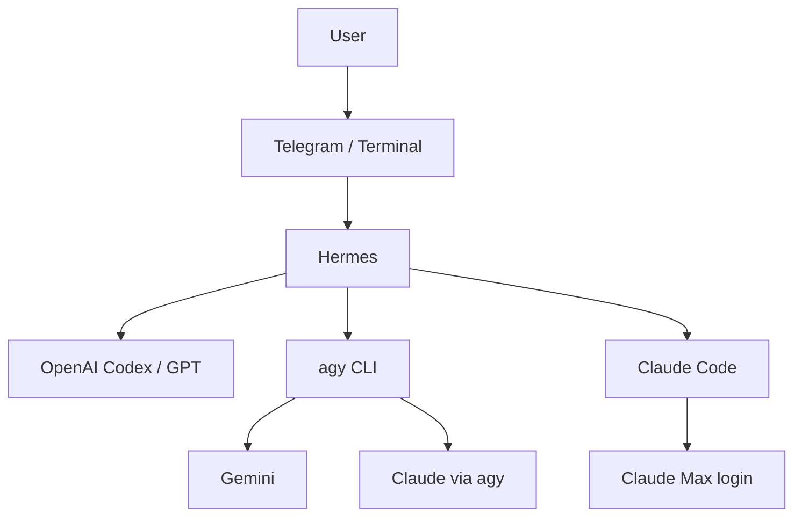

# BOOTSTRAP — Hermes AI Workflow Environment

이 문서는 이 저장소의 **자동 설치·점검·복구용 단일 진입점**입니다.

사용자는 이 문서를 직접 단계별로 따라 하기보다, Codex 같은 에이전트에게 이 저장소와 `BOOTSTRAP.md`를 읽도록 지시하는 것을 권장합니다.

---

# 1. 목표

다음 환경을 가능한 범위까지 자동으로 구성하고 실제 호출까지 검증합니다.

- Hermes
- OpenAI Codex / GPT 계열
- agy CLI
- Gemini via agy
- Claude via agy
- Claude Code CLI
- Claude Max 로그인 경로
- Telegram Bot
- Hermes ↔ Telegram gateway
- 사용자 pairing / authorization
- PC 재시작 후 Telegram 챗봇 재동작 확인

최종 완료 기준은 단순 설치가 아니라 다음 왕복 경로가 실제 동작하는 것입니다.

```text
Telegram
→ Hermes
→ AI Model
→ Hermes
→ Telegram
```

---

# 2. 운영 원칙

에이전트는 다음 원칙을 지킵니다.

- 기존 정상 환경은 재설치하지 않습니다.
- 기존 설정 파일과 로그인 세션을 보존합니다.
- Windows에서는 Ubuntu/WSL을 불필요하게 설치하지 않습니다.
- 공식 프로젝트 문서와 현재 설치된 버전을 우선 기준으로 사용합니다.
- 로그인, OAuth 승인, 결제, 비밀번호 입력은 사용자가 직접 수행합니다.
- API Key, Bot Token, OAuth Token, 비밀번호를 로그에 출력하지 않습니다.
- 단순히 프로그램이 설치되어 있다는 이유로 PASS 처리하지 않습니다.
- **실제 모델 호출 또는 실제 Telegram 메시지 왕복 성공을 PASS 기준으로 사용합니다.**
- 오류가 발생해도 전체 환경을 무조건 다시 설치하지 않습니다.
- 이미 PASS한 단계는 유지하고 실패한 단계만 진단·복구합니다.

---

# 3. STEP 1 — 현재 환경 탐지

다음을 확인합니다.

- 운영체제 및 버전
- Shell
- CPU architecture
- Git
- Python
- uv
- Node.js / npm
- Hermes
- agy
- Claude Code CLI
- Telegram gateway 관련 Hermes 설정
- 기존 Hermes 작업 폴더
- 기존 로그인 세션

가능하면 다음 표로 정리합니다.

| Component | Installed | Version | Path | Status | Action |
|---|---:|---|---|---|---|
| Git | | | | | KEEP/INSTALL/FIX |
| Python | | | | | |
| uv | | | | | |
| Node.js | | | | | |
| Hermes | | | | | |
| agy | | | | | |
| Claude Code | | | | | |
| Telegram Gateway | | | | | |

---

# 4. STEP 2 — Hermes 설치 또는 기존 환경 확인

## 기존 설치가 있는 경우

다음을 확인합니다.

```text
hermes --version
hermes model
```

추가로 확인합니다.

- Hermes 설치 경로
- Hermes home
- 현재 기본 모델
- 기존 gateway 설정
- 사용자 작업 디렉터리
- 기존 Telegram 설정 여부

정상 설치라면 재설치하지 않습니다.

## 설치되어 있지 않은 경우

NousResearch의 최신 공식 Hermes 문서를 확인합니다.

Windows이면 Windows native 설치 경로를 우선합니다.

Linux이면 공식 Linux 설치 경로를 사용합니다.

Windows에서 단지 Linux 문서가 익숙하다는 이유로 Ubuntu 또는 WSL을 설치하지 않습니다.

설치 후 다음을 검증합니다.

```text
hermes --version
hermes model
hermes
```

---

# 5. STEP 3 — OpenAI Codex / GPT 연결

목표:

```text
Hermes
└─ Primary Model
   └─ OpenAI Codex / GPT
```

다음을 확인합니다.

1. 기존 로그인 여부
2. Hermes 모델 설정
3. 사용 가능한 모델
4. 실제 모델 호출

테스트 요청 예시:

```text
Reply only with: HERMES_OK
```

`HERMES_OK`가 정상 반환되어야 PASS입니다.

로그인이 필요한 경우 사용자가 직접 로그인합니다.

---

# 6. STEP 4 — agy CLI 확인

## 설치 확인

```text
agy --version
```

현재 버전에서 명령 형식이 다르면 설치된 버전의 도움말과 최신 공식 문서를 확인합니다.

설치되어 있지 않다면 공식 설치 방식을 사용합니다.

---

# 7. STEP 5 — Gemini via agy 검증

다음 조건을 확인합니다.

- agy 실행 가능
- Gemini 인증 가능
- 실제 모델 호출 성공

테스트 요청:

```text
Reply only with: GEMINI_OK
```

`GEMINI_OK` 응답이 실제로 반환되어야 PASS입니다.

단순 모델 목록 표시만으로 PASS 처리하지 않습니다.

---

# 8. STEP 6 — Claude via agy 검증

Claude가 agy에서 사용 가능한 경우 실제 호출합니다.

테스트 요청:

```text
Reply only with: AGY_CLAUDE_OK
```

주의:

```text
agy Claude
≠
Claude Code
≠
Claude Max 로그인
≠
Anthropic API Key
```

서로 다른 인증 경로를 같은 것으로 취급하지 않습니다.

---

# 9. STEP 7 — Claude Code / Claude Max

## Claude Code 설치 확인

Claude Code CLI가 설치되어 있는지 확인합니다.

없다면 Anthropic의 최신 공식 설치 문서를 사용합니다.

## Claude Max 로그인

사용자가 Claude Max 구독을 사용하는 경우 현재 Claude Code에서 지원되는 공식 로그인 방식으로 로그인하도록 안내합니다.

인증은 사용자가 직접 수행합니다.

## 실제 호출 테스트

예:

```text
Reply only with: CLAUDE_CODE_OK
```

실제 응답 확인 후 PASS 처리합니다.

---

# 10. STEP 8 — 역할 구조 확인

권장 기본 구조:



권장 역할:

| 역할 | 경로 |
|---|---|
| 기본 오케스트레이션 | Hermes + OpenAI Codex |
| Gemini 보조 검토 | agy |
| Claude 보조 검토 | agy 또는 Claude Code |
| Claude Max 활용 | Claude Code |
| 원격 사용자 인터페이스 | Telegram |

모든 사용자가 Gemini와 Claude를 반드시 연결할 필요는 없습니다.

최소 구성:

```text
Hermes + OpenAI Codex + Telegram
```

만으로도 기본 자동화 실습이 가능합니다.

---

# 11. STEP 9 — Telegram 설치 및 계정 준비

사용자가 직접 수행합니다.

1. Telegram 설치
2. 전화번호 인증
3. Telegram 로그인
4. Telegram에서 인증된 `@BotFather` 검색

계정 생성 및 로그인은 사용자가 직접 진행합니다.

---

# 12. STEP 10 — BotFather에서 Bot 생성

사용자에게 다음 절차를 안내합니다.

1. `@BotFather` 실행
2. `/newbot`
3. Bot 표시 이름 설정
4. Bot username 설정
5. Bot Token 발급

Bot username은 Telegram 정책상 필요한 형식을 따릅니다.

발급된 Bot Token은 민감한 자격 증명으로 취급합니다.

절대 다음 위치에 기록하지 않습니다.

- GitHub
- Notion 공개 페이지
- README
- 화면 캡처
- 일반 로그
- 보고서

Bot Token이 노출된 경우 BotFather에서 즉시 폐기 또는 재발급합니다.

---

# 13. STEP 11 — Hermes ↔ Telegram Gateway 연결

현재 설치된 Hermes 버전의 공식 문서를 확인합니다.

중요:

Hermes 버전에 따라 gateway 명령, 설정 파일 위치, Telegram 연결 방식이 달라질 수 있으므로 고정된 오래된 명령을 무조건 사용하지 않습니다.

에이전트는 다음 순서로 수행합니다.

1. 현재 Hermes 버전 확인
2. 현재 공식 Telegram gateway 설정 확인
3. 기존 gateway 설정 존재 여부 확인
4. 기존 설정을 보존
5. Bot Token 입력이 필요한 정확한 위치만 사용자에게 안내
6. 사용자가 직접 Token 입력
7. Telegram gateway 실행 또는 활성화
8. gateway 상태 확인

Bot Token 값은 다시 출력하지 않습니다.

---

# 14. STEP 12 — Telegram 사용자 Pairing / Authorization

Hermes가 Telegram 사용자 승인을 요구하는 경우:

1. 사용자가 자신의 Telegram Bot에 첫 메시지를 전송
2. Hermes에서 pending user 또는 pairing 요청 확인
3. 해당 사용자 ID 확인
4. 사용자가 승인 대상이 맞는지 확인
5. 해당 사용자만 승인

교육자료나 로그에 실제 Telegram User ID를 불필요하게 기록하지 않습니다.

다른 사용자를 자동 승인하지 않습니다.

---

# 15. STEP 13 — Telegram 실제 왕복 테스트

Telegram Bot에 실제 메시지를 보냅니다.

예:

```text
정상 연결 테스트야. TELEGRAM_OK라고 답해줘.
```

다음 경로가 실제 동작해야 합니다.

```text
Telegram User
→ Telegram Bot
→ Hermes Gateway
→ Hermes
→ AI Model
→ Hermes
→ Telegram Bot
→ Telegram User
```

최종 응답에서:

```text
TELEGRAM_OK
```

를 확인해야 PASS입니다.

---

# 16. STEP 14 — PC 재시작 후 재검증

초기 설치 직후만 동작하는 것으로 완료 처리하지 않습니다.

가능하면 다음을 확인합니다.

1. 현재 Hermes/gateway 상태 기록
2. PC 재부팅
3. 로그인
4. Telegram에서 Bot에 테스트 메시지 전송
5. gateway가 정상적으로 다시 시작되는지 확인
6. 실제 AI 응답 확인

재부팅 후 동작하지 않으면:

- Hermes 자동 시작
- Telegram gateway 자동 시작
- Shell 환경
- PATH
- 로그인 세션
- Windows 서비스 또는 startup 방식

중 어느 부분이 원인인지 구분합니다.

현재 Hermes 공식 문서에서 지원하는 방식이 있다면 그 방식을 우선 사용합니다.

---

# 17. STEP 15 — 첫 업무 자동화 테스트

Telegram을 통해 단순 인사만 하는 것으로 끝내지 않습니다.

다음 중 최소 하나를 실행합니다.

## 자료 조사

```text
최신 자료 5개를 조사해서
제목, 날짜, 출처, 핵심 내용으로 정리해줘.
출처 링크도 포함해줘.
```

## 파일 생성

```text
조사 내용을 보고서 초안으로 만들고
output 폴더에 저장해줘.
사용한 출처와 생성 파일을 정리해줘.
```

## 멀티모델 검토

```text
초안은 OpenAI Codex로 작성하고
핵심 사실과 논리 오류를 Gemini 또는 Claude로 교차 검토해줘.
모델별 의견 차이를 구분해서 보고해줘.
```

---

# 18. STEP 16 — 오류 처리 정책

오류가 발생해도 전체 설치를 처음부터 다시 하지 않습니다.

다음 형식으로 진단합니다.

```text
Completed:
- ...

Failed:
- ...

Failure Layer:
- Telegram / Hermes / agy / Claude Code / Authentication / Environment

Cause:
- ...

Recovery:
- ...

Retest:
- PASS / FAIL
```

우선적으로 실패한 계층만 수정합니다.

---

# 19. 보안 정책

절대 출력하지 않습니다.

- API Key 전체 문자열
- Telegram Bot Token
- OAuth Access Token
- Refresh Token
- Password
- Session Cookie
- Private Key

로그에 필요한 경우 마스킹합니다.

예:

```text
123456...ABCD
sk-...ABCD
```

---

# 20. 최종 PASS/FAIL 검증표

모든 작업이 끝나면 반드시 다음 표를 출력합니다.

| 항목 | 상태 | 버전/연결 | 실제 검증 | 비고 |
|---|---|---|---|---|
| Hermes | PASS/FAIL | | | |
| OpenAI Codex | PASS/FAIL | | | |
| agy CLI | PASS/FAIL/N/A | | | |
| Gemini via agy | PASS/FAIL/N/A | | | |
| Claude via agy | PASS/FAIL/N/A | | | |
| Claude Code | PASS/FAIL/N/A | | | |
| Claude Max 로그인 | PASS/FAIL/N/A | | | |
| Telegram Bot 생성 | PASS/FAIL | | | |
| Hermes Telegram Gateway | PASS/FAIL | | | |
| Telegram Pairing | PASS/FAIL/N/A | | | |
| Telegram 실제 왕복 테스트 | PASS/FAIL | | | |
| 재부팅 후 Telegram 재동작 | PASS/FAIL | | | |

---

# 21. 완료 판정

다음 조건을 모두 만족하면 기본 구축 완료입니다.

## 필수

- Hermes 실행 가능
- OpenAI Codex/GPT 실제 응답
- Telegram Bot 생성
- Hermes ↔ Telegram 연결
- Telegram 실제 왕복 응답
- 민감정보 노출 없음

## 권장

- PC 재부팅 후 재동작
- Gemini 실제 호출
- Claude 실제 호출
- 첫 업무 자동화 테스트 완료

---

# 22. 최종 사용자 안내

마지막에는 사용자가 앞으로 기억해야 할 명령만 최대 3~5개로 정리합니다.

예:

```text
hermes
hermes model
agy ...
claude
```

실제 설치된 버전에서 유효한 명령만 제공합니다.

Telegram은 사용자가 일상적으로 사용할 인터페이스이므로 CLI 명령을 외울 필요가 없도록 구성합니다.

---

# 23. 상세 문서 사용 원칙

`BOOTSTRAP.md`가 기본 진입점입니다.

다른 문서는 필요할 때만 확인합니다.

1. `BOOTSTRAP.md`
2. 설치 문제 → `docs/01-install.md`
3. 모델 연결 문제 → `docs/02-model-connections.md`
4. Telegram 문제 → `docs/03-telegram.md`
5. 실습 → `docs/04-workflows.md`
6. 변경 이력 → `docs/05-environment-and-changelog.md`

---

# 24. 에이전트 최종 행동 원칙

사용자가 다음과 같이 요청하면:

```text
이 저장소의 BOOTSTRAP.md를 읽고 설치해줘.
```

에이전트는 단순히 설치 방법을 설명하지 말고 가능한 범위에서 직접:

```text
환경 탐지
→ 기존 설치 확인
→ 필요한 설치
→ 모델 연결
→ 실제 호출
→ Telegram 연결
→ Pairing
→ Telegram 왕복 테스트
→ 재부팅 후 재검증
→ 최종 PASS/FAIL 보고
```

까지 수행합니다.

단,

```text
로그인
OAuth 승인
비밀번호
API Key
Bot Token
결제
계정 권한 승인
```

등 사용자만 수행해야 하는 단계에서는 정확한 입력 위치와 이유만 안내하고 사용자의 작업을 기다립니다.
